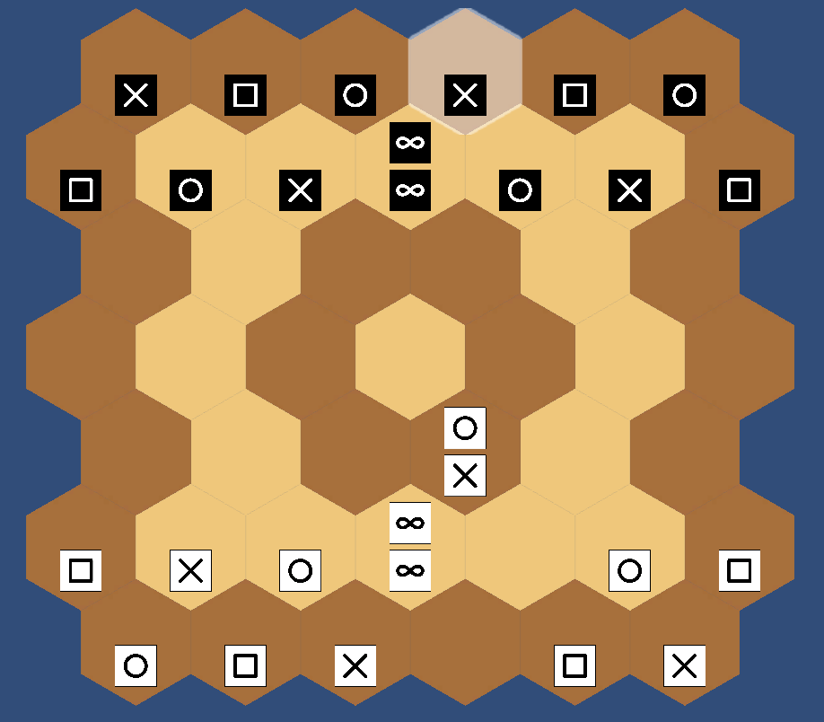

# Universal Game Interface (UGI)

Natural Selection can use the UGI protocol to communicate and play against other engines.
An overview can be found here: [GitHub](https://github.com/kz04px/cutegames/blob/master/ugi.md)

## Positions - Pijersi Standard Notation (PSN)

The Pijersi Standard Notation (PSN) notation is inspired by the Forsyth–Edwards Notation (FEN) in Chess ([Wikipedia](https://en.wikipedia.org/wiki/Forsyth–Edwards_Notation)).

### Pieces

The pieces are represented as such:
* Scissors : `S` or `s`
* Paper : `P` or `p`
* Rock : `R` or `r`
* Wise : `W` or `w`

White pieces are uppercase and black pieces are lowercase.

A single piece (without stack) is represented as `x-`. A stack is represented as `bt` where `b` is the bottom piece, and `t` is the top piece.

### Empty space

Empty space in the board is represented by a number equal to the number of empty cells between:
* Either the last non-empty cell or the beginning of the line
* Either the next non-empty cell or the end of the line

### Lines

The lines are separated by slashes (`/`). They are written from top to bottom. The pieces in each line are written from left to right.

The starting position is represented as: `s-p-r-s-p-r-/p-r-s-wwr-s-p-/6/7/6/P-S-R-WWS-R-P-/R-P-S-R-P-S- w 0 1`

The above position (after move a4b5c4) is represented as: `s-p-r-s-p-r-/p-r-s-wwr-s-p-/6/7/3SR2/P-S-R-WW1R-P-/R-P-S-1P-S- b 1 1`

## Moves

Moves need to be represented a set of two or three coordinates.

Cells are indexed with :

* A lowercase letter that represents the line (from bottom to top): `a` to `g`
* A number that represents the column (from left to right): `1` to `6` or `1` to `7`

The number of coordinates depends on if the starting piece is a single piece or a stack.

If the starting piece is a single piece, and the action is a simple move or a simple stack, the move is represented by the starting and ending coordinates.

If the starting piece is a single piece and the action is stack-move, then the move is represented by the starting, middle, and ending coordinates.

todo stack

In order to check if the move representation matches UGI, a list of all the starting moves can be found here: [Split Perft 1 results](doc/perftsplit_1_startpos.txt).

## Commands

An engine that implements UGI has to be able to respond to the following commands.

* `ugi`
* `isready`
* `go`
